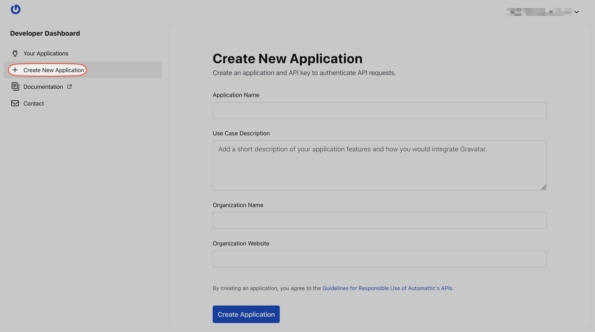

# Get Started with Gravatar-SDK-Android

## Creating an API key

You'll need an API key to use the SDK's full capabilities. You can use some features without an API Key, but you'll receive limited information, and stricter rate limits may apply, so we highly encourage you to create one in the [developers' portal](https://gravatar.com/developers/). 

You can create the API Key as follows:

1. Login in to your Gravatar account (or the Gravatar account you want to use to generate the key)
2. Navigate to the [developers portal](https://gravatar.com/developers/)
3. Tap on [`Create new Application`](https://gravatar.com/developers/new-application)
4. Fill the required data and follow the flow



5. You'll get your Gravatar API Key. Save it in a safe place!

## Installation

First step is to add the maven repositories to the file where you manage your the dependency resolution and the right dependencies to the `build.gradle` file:

### Add the Gravatar dependencies to your project

```groovy
repositories {
    maven {
        url "https://a8c-libs.s3.amazonaws.com/android"
    }
}
```

```groovy
dependencies {
    implementation ("com.gravatar:gravatar:<version>")
    implementation ("com.gravatar:gravatar-ui:<version>")
    implementation ("com.gravatar:gravatar-quickeditor:<version>")
}
```

### Store the Gravatar API key in your app

There are many ways to store the Gravatar API key in your app. The best way to do this depends on your app's architecture and requirements and how you're already storing other sensitive information. Make sure to avoid hardcoding the API key in your app's code and make sure to avoid storing it in a public repository.

One way to store the API key in your app is by adding it to the `local.properties` file:

```properties
gravatar.api.key = REPLACE_ME
```

Then update your gradle file to read the API key from the `local.properties` file and put it in the generated `BuildConfig` class:

```groovy
android {
    buildFeatures.buildConfig = true

    val properties = Properties()
    properties.load(FileInputStream(project.rootProject.file("local.properties")))
    buildConfigField("String", "GRAVATAR_API_KEY", "\"${properties["gravatar.api.key"]}\"")
}
```

Then you can access the API key in your app's code like this:

```kotlin
Gravatar.initialize(BuildConfig.GRAVATAR_API_KEY)
```

# Usage

The Gravatar SDK is separated into three modules: [`:gravatar`](#REST-API-Services), [`:gravatar-ui`](#UI-components) and [`:gravatar-quickeditor`](#Quick-Editor). They can be used all together or you can pick the one that suits your needs.
Below you can find description of how to use each module.

## REST API Services

The `:gravatar` module provides services that you can use to interact with Gravatar backend. It provides: `ProfileService` and `AvatarService` that correspond to the exposed public [REST API](https://docs.gravatar.com/api/).

Here's an example how to fetch the user Profile with an email:

```kotlin
coroutineScope.launch {
    when (val profile = ProfileService().retrieveCatching(Email("gravatar@automattic.com"))) {
        is GravatarResult.Success -> {
            Log.d("Gravatar", "Profile: ${profile.value}")
            // Do something with the profile
        }

        is GravatarResult.Failure -> {
            Log.e("Gravatar", "Error: ${profile.error}")
            // Handle the error
        }
    }
}
```

## UI components

The `:gravatar-ui` module provides various different types of Profile cards to suit your needs. They vary in size and the number of information presented to the user.

| Profile                                  | ProfileSummary                        | LargeProfile                        | LargeProfileSummary                         |
|------------------------------------------|---------------------------------------|-------------------------------------|---------------------------------------------|
|  |  |  |  |


### Add a Profile Component to your Jetpack Compose App

You can use the following code snippet to integrate the Gravatar profile in your app. This is a very simple component that fetches a Gravatar profile and displays it in a `ProfileCard` composable.

```kotlin
@Composable
fun GravatarProfileSummary(emailAddress: String = "gravatar@automattic.com") {
    // Create a ProfileService instance
    val profileService = ProfileService()

    // Set the default profile state to loading
    var profileState: ComponentState<Profile> by remember { mutableStateOf(ComponentState.Loading, neverEqualPolicy()) }

    // We wrap the fetch call in a LaunchedEffect to fetch the profile when the composable is first launched, but this
    // could be triggered by a button click, a text field change, etc.
    LaunchedEffect(emailAddress) {
        // Set the profile state to loading
        profileState = ComponentState.Loading
        // Fetch the user profile
        when (val result = profileService.retrieve(Email(emailAddress))) {
            is GravatarResult.Success -> {
                // Update the profile state with the loaded profile
                result.value.let {
                    profileState = ComponentState.Loaded(it)
                }
            }
            is GravatarResult.Failure -> {
                // An error can occur when a profile doesn't exist, if the phone is in airplane mode, etc.
                // Here we log the error, but ideally we should show an error to the user.
                Log.e("Gravatar", result.error.name)
                // Set the Empty state on error
                profileState = ComponentState.Empty
            }
        }
    }

    // Show the profile as a ProfileCard
    ProfileSummary(profileState, modifier = Modifier.fillMaxWidth().padding(16.dp))
}
```

### Add a Profile Component to your View-based App

If you are using a View-based app, you can use the following code snippet to integrate the Gravatar profile in your app. This is an example of a very simple component that fetches a Gravatar profile and displays it in a `ProfileCard`.

In your layout xml file, you need to add the following view:

```xml
... 
    <androidx.compose.ui.platform.ComposeView
        android:id="@+id/gravatarComposeView"
        android:layout_width="wrap_content"
        android:layout_height="wrap_content" />

...

```

From the code, you can set the composable code to that view as follows:
```kotlin

class ExampleActivity : ComponentActivity() {
    override fun onCreate(savedInstanceState: Bundle?) {
        super.onCreate(savedInstanceState)

        setContentView(R.layout.activity_main)
        findViewById<ComposeView>(R.id.gravatarComposeView).setContent {
            GravatarProfileSummary()
        }
    }
}


@Composable
fun GravatarProfileSummary(emailAddress: String = "gravatar@automattic.com") {
    // Create a ProfileService instance
    val profileService = ProfileService()

    // Set the default profile state to loading
    var profileState: ComponentState<Profile> by remember { mutableStateOf(ComponentState.Loading, neverEqualPolicy()) }

    // We wrap the fetch call in a LaunchedEffect to fetch the profile when the composable is first launched, but this
    // could be triggered by a button click, a text field change, etc.
    LaunchedEffect(emailAddress) {
        // Set the profile state to loading
        profileState = ComponentState.Loading
        // Fetch the user profile
        when (val result = profileService.retrieve(Email(emailAddress))) {
            is GravatarResult.Success -> {
                // Update the profile state with the loaded profile
                result.value.let {
                    profileState = ComponentState.Loaded(it)
                }
            }
            is GravatarResult.Failure -> {
                // An error can occur when a profile doesn't exist, if the phone is in airplane mode, etc.
                // Here we log the error, but ideally we should show an error to the user.
                Log.e("Gravatar", result.error.name)
                // Set the Empty state on error
                profileState = ComponentState.Empty
            }
        }
    }

    // Show the profile as a ProfileCard
    ProfileSummary(profileState, modifier = Modifier.fillMaxWidth().padding(16.dp))
}
```

More information on the official documentation: [Using Compose in Views](https://developer.android.com/develop/ui/compose/migrate/interoperability-apis/compose-in-views).

### Override the GravatarTheme

You're free to customize the Gravatar profile component to fit your app's design. You can do this by overriding the `GravatarTheme` in your app's theme.

```kotlin
CompositionLocalProvider(LocalGravatarTheme provides object : GravatarTheme {
    // Override theme colors
    override val colorScheme: ColorScheme
        @Composable
        get() = MaterialTheme.colorScheme.copy(outline = Color.LightGray)

    // Override typography style
    override val typography: Typography
        @Composable
        get() = MaterialTheme.typography.copy(
            headlineSmall = MaterialTheme.typography.headlineSmall.copy(fontWeight = FontWeight.ExtraBold),
        )
}) {
    LargeProfileSummary(profile = userProfile)
}
```

## Quick Editor

The `:gravatar-quickeditor` module provides a fully featured component that allows the user to modify their avatar without leaving your app. 

To do that the QuickEditor needs an authorization token to perform requests on behalf of the user. There are two ways for that:

### 1. Let the Quick Editor handle the OAuth flow

Quick Editor can handle the heavy lifting of running the full OAuth flow, so you don't have to do that. We will still need a few things from you.
First, you have to go to [OAuth docs](https://docs.gravatar.com/?page_id=2555&preview=true) and create your Application. Define the `Redirect URLs`.

> Keep in mind that you need to use the `https` scheme. Internally, QuickEditor uses Implicit OAuth flow (`response_type=token`) and for security reasons, the server doesn't allow custom URL schemes.

For the sake of this example let's assume the redirect URL is `https://yourhost.com/redirect-url`.

In your `AndroidManifest.xml` you need to add an `<intent-filter>` and the `android:launchMode="singleTask"` to the activity that will 
launch the Quick Editor (or the last/main activity depending on your app architecture). This is important because the Quick Editor will be waiting for the `onNewIntent()` callback to handle OAuth redirection.

```xml
<activity
    android:name=".YourActivity"
    android:launchMode="singleTask"
    ...>
    <intent-filter android:autoVerify="true">
        <action android:name="android.intent.action.VIEW" />

        <category android:name="android.intent.category.DEFAULT" />
        <category android:name="android.intent.category.BROWSABLE" />

        <data
            android:scheme="https"
            android:host="yourhost.com"
            android:pathPrefix="/redirect-url"
        />
    </intent-filter>
</activity>
```

> Make sure to follow official [Android App Links documentation](https://developer.android.com/training/app-links#android-app-links) to properly setup App Link.

Once you've added that you can add the Quick Editor to your Compose screen:

```kotlin
var showBottomSheet by rememberSaveable { mutableStateOf(false) }

if (showBottomSheet) {
    GravatarQuickEditorBottomSheet(
        gravatarQuickEditorParams = GravatarQuickEditorParams {
            email = Email("{USER_EMAIL}")
            avatarPickerContentLayout = AvatarPickerContentLayout.Horizontal
        },
        authenticationMethod = AuthenticationMethod.OAuth(
            OAuthParams {
                clientId = "{YOUR_CLIENT_ID}"
                redirectUri = "{YOUR_REDIRECT_URL}" // In our example this would be https://yourhost.com/redirect_url
            },
        ),
        onAvatarSelected = { avatarUpdateResult -> ... },
        onDismiss = { gravatarQuickEditorDismissReason ->
            showBottomSheet = false
            ...
        },
    )
}
```

With the provided `clientId` and the `redirectUrl` Quick Editor can launch and handle the full OAuth flow. Once obtained the token will be stored in an encrypted Data Store.
This token will be later used in subsequent Quick Editor launches to make the user experience more seamless by not having to go through the OAuth flow each time.

When the user logs out form the app, make sure to run:

```kotlin
GravatarQuickEditor.logout(Email("{USER_EMAIL}"))
```

#### Exclude Data Store files from Android backup (optional, but recommended)

Data Store files are subject to Android backups. Encrypted files from the backup won't work when restored on a different device so we have to exclude those files.
If your app has backup rules configured, those that are provided in the SDK won't be used so you have to copy them to your files.

<details>
  <summary>Instructions</summary>

In `AndroidManifest.xml` add those lines:

```xml
<application
        android:allowBackup="true"
        android:dataExtractionRules="@xml/data_extraction_rules"
        android:fullBackupContent="@xml/backup_rules"
        ...>
```

Content of the [@xml/data_extraction_rules](https://github.com/Automattic/Gravatar-SDK-Android/blob/trunk/gravatar-quickeditor/src/main/res/xml/data_extraction_rules.xml)

```xml
<?xml version="1.0" encoding="utf-8"?>
<data-extraction-rules>
    <cloud-backup>
        <exclude
            domain="sharedpref"
            path="__androidx_security_crypto_encrypted_file_pref__.xml" />
        <exclude
            domain="file"
            path="datastore/quick-editor-preferences.preferences_pb" />
    </cloud-backup>
    <device-transfer>
        <exclude
            domain="sharedpref"
            path="__androidx_security_crypto_encrypted_file_pref__.xml" />
        <exclude
            domain="file"
            path="datastore/quick-editor-preferences.preferences_pb" />
    </device-transfer>
</data-extraction-rules>
```

Content of the [@xml/backup_rules](https://github.com/Automattic/Gravatar-SDK-Android/blob/trunk/gravatar-quickeditor/src/main/res/xml/backup_rules.xml)

```xml
<?xml version="1.0" encoding="utf-8"?>
<full-backup-content>
    <exclude
        domain="sharedpref"
        path="__androidx_security_crypto_encrypted_file_pref__.xml" />
    <exclude
        domain="file"
        path="datastore/quick-editor-preferences.preferences_pb" />
</full-backup-content>
```

</details>

### 2. Obtain the token yourself and provide it to the Quick Editor

Quick Editor can be launched with the provided token. To obtain it, you have to follow the [OAuth docs](https://docs.gravatar.com/?page_id=2555&preview=true) and implement the OAuth flow within your app.

Once you have the token, here's how you can embed the QuickEditor in your Compose screen:

```kotlin
var showBottomSheet by rememberSaveable { mutableStateOf(false) }

if (showBottomSheet) {
    GravatarQuickEditorBottomSheet(
        gravatarQuickEditorParams = GravatarQuickEditorParams {
            email = Email("{USER_EMAIL}")
            avatarPickerContentLayout = AvatarPickerContentLayout.Horizontal
        },
        authenticationMethod = AuthenticationMethod.Bearer("{TOKEN}"),
        onAvatarSelected = { avatarUpdateResult -> ... },
        onDismiss = { gravatarQuickEditorDismissReason ->
            showBottomSheet = false
            ...
        },
    )
}
```

### Activity/Fragment compatibility

Gravatar SDK is built with Compose but we do provide some helper functions to launch the Quick Editor from an Activity or Fragment. Here's an example an Activity:

```kotlin
GravatarQuickEditor.show(
    activity = this,
    gravatarQuickEditorParams = GravatarQuickEditorParams {
        email = Email("{USER_EMAIL}")
        avatarPickerContentLayout = AvatarPickerContentLayout.Horizontal
    },
    authenticationMethod = AuthenticationMethod.Bearer("{TOKEN}"),
    onAvatarSelected = { avatarUpdateResult -> ... },
    onDismiss = { gravatarQuickEditorDismissReason -> ... },
)
```